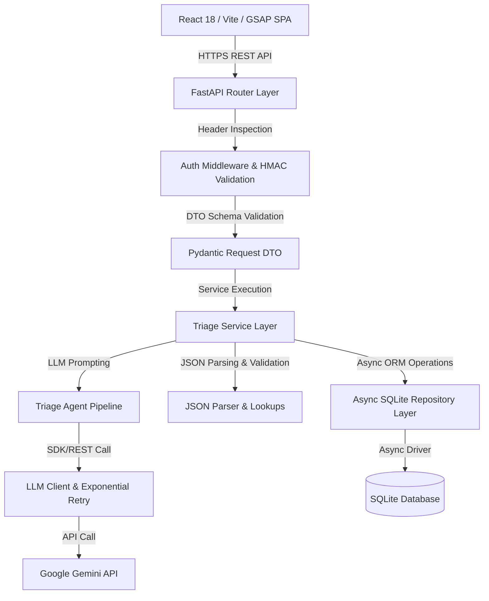
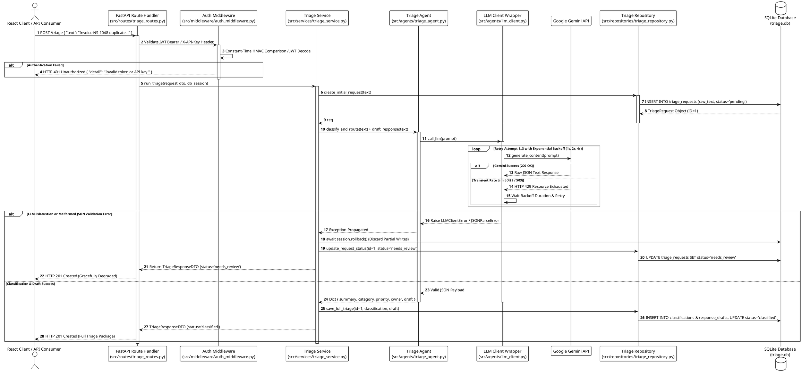

# AI Request Triage Assistant — Architecture & Technical Flow Specification

## 🏛️ System Architecture Overview

The **AI Request Triage Assistant** is engineered as a decoupled, multi-tiered enterprise application designed to process unstructured business requests, categorize intent, assign priority scores, route to owner teams, and generate tailored initial draft responses.

---

## ⏱️ Detailed Request Execution & Exception Flow

The sequence diagram below details the two-tier error boundary architecture, showing how domain/LLM errors trigger graceful degradation (`needs_review`) while system errors trigger DB error logging.

### PlantUML Flow Diagram (`architecture_sequence.puml`)

---

## 🔍 Why Each Architectural Layer Is Present (Technical Justification)

### 1. **Decoupled Frontend (React 18 / Vite / GSAP)**
* **Why it exists**: Provides an immersive enterprise UI with real-time feedback (`ProgressiveLoader`), glassmorphism aesthetics, dynamic JWT decoding, and particle canvas rendering.
* **Technical Rationale**: Keeps client presentation logic isolated from API processing. Utilizes `apiFetch` with `AbortController` timeouts (15s/30s) to prevent frozen UI states.

### 2. **Authentication Middleware & HMAC Comparison**
* **Why it exists**: Secures protected endpoints using either JWT Bearer tokens or `X-API-Key` headers.
* **Technical Rationale**: Uses `hmac.compare_digest()` for constant-time string verification. This eliminates **timing side-channel attacks** where an attacker could deduce key characters by measuring CPU response micro-latencies.

### 3. **Pydantic DTO (Data Transfer Object) Boundary**
* **Why it exists**: Enforces strict payload contracts (`LoginRequestDTO`, `TriageRequestDTO`) at the perimeter of the application.
* **Technical Rationale**: Prevents malformed, truncated, or malicious payloads from reaching service domain logic, returning standard HTTP 422 validation errors automatically.

### 4. **Service Boundary & Transaction Rollback Order**
* **Why it exists**: Manages business workflows, orchestration, and database transactions (`src/services/triage_service.py`).
* **Technical Rationale**: Ensures **atomic state management**. In case of LLM failure or JSON parse error, calling `await session.rollback()` *before* updating `status = "needs_review"` guarantees that partially flushed ORM objects (e.g. invalid classification drafts) are discarded, preventing orphan records or database corruption.

### 5. **Two-Tier Error Handling Architecture**
* **Why it exists**: Separates expected domain failures from unexpected system crashes.
* **Technical Rationale**:
  * **Tier 1 (Domain LLM/Validation Errors)**: Catches `(JSONParseError, ValidationError, LLMClientError)`. Gracefully degrades request status to `"needs_review"` and returns HTTP 201 Created so business workflows are not blocked by LLM hiccups.
  * **Tier 2 (System/Database Crashes)**: Intercepts unhandled system exceptions in global exception handlers, logs full tracebacks to the database `ErrorLog` table, and returns clean HTTP 500 responses without exposing internal server internals.

### 6. **Asynchronous SQLite (`aiosqlite` + SQLAlchemy 2.0)**
* **Why it exists**: Handles database persistence asynchronously without blocking Python's event loop.
* **Technical Rationale**: Synchronous I/O operations block Uvicorn worker threads. `aiosqlite` allows FastAPI to serve high-concurrency requests while database reads and writes execute asynchronously.

### 7. **LLM Client Wrapper with Exponential Backoff**
* **Why it exists**: Manages raw interaction with the Google Gemini API (`src/agents/llm_client.py`).
* **Technical Rationale**: Implements automated retries for transient errors (HTTP 429 rate limits, 503 service unavailable) with exponential backoff (`1s`, `2s`, `4s`), ensuring resilience against upstream API instability.
